# Psychopath Test (only for fun)
This is a short psychological test to see if you are a psychopath. This is not a verified test and it is only for entertainment purposes. 

There are total 6 questions each has 5 answer options. User should select one answer from each question by entering either a, b, c, d or e. Only one answer will be available as an input.

[*Click here to see the Live Deployment*](https://psychopath-test.herokuapp.com/)

## Flowchart
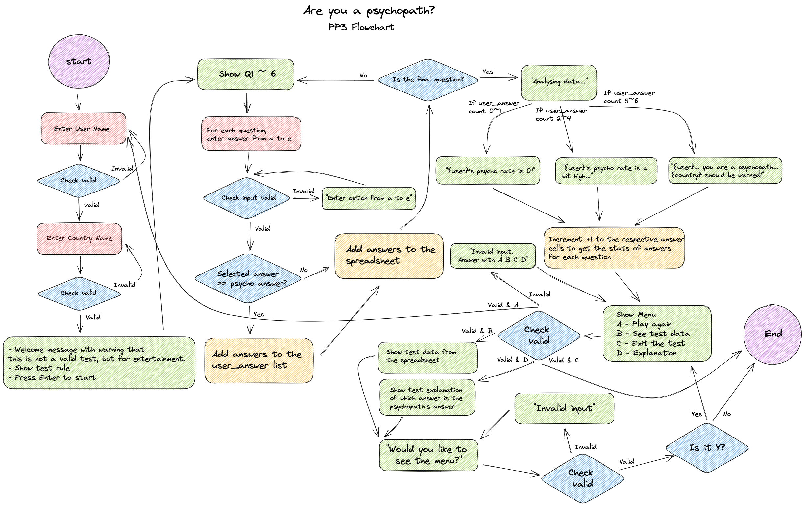

## Features

### 1. Welcome
- User is welcomed with an ASCII artwork saying 'AM I PSYCHOPATH?' with welcome messages. Warning message letting the user know that this is not a verified test for checking whether they are a psychopath. 
- Then user is asked to press Enter to continue. 

  

### 2. Disclaimer & Enter Name
- User sees a disclaimer that the entered personal data will not be collected and only the selected answers will be used for counting the statistics.
- User is asked to enter their name.
- Pressing Enter without entering anything will trigger a message 'Invalid input. Please enter your name:' that will ask the user to enter at least something.
  

### 3. Enter Country
- User is greeted by the message 'Hello, {username}'.
- Username is all capitalized.
- Then user is asked to enter their country.
- Same as name input function, pressing Enter without entering anything will trigger a message 'Invalid input. Please enter your country:' that will ask the user to enter at least something.
  

### 4. Instruction
- User is greeted by the name and the country they entered. 
- Country is capitalized.
- Instruction of how to do the test is shown. 
- User should press Enter to continue.
  

### 5. Question
- Question from 1 to 6 will show up accordingly.
- User should answer by entering either a, b, c, d or e.
- Inputting the answer with capital letters will also be accepted since all answers will be converted to lowercase.
- Next question will show up once the user enters the answer.
  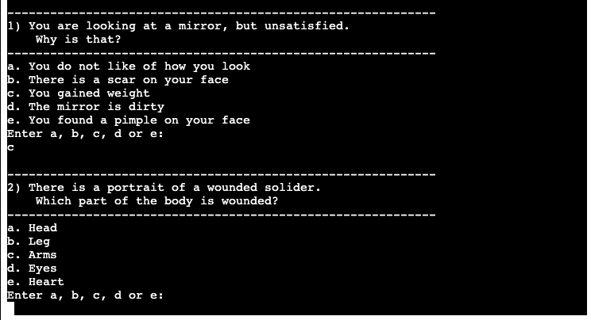

- Entering something rather than a, b, c, d or e will trigger a message 'Please answer with a, b, c, d, e:'. 
  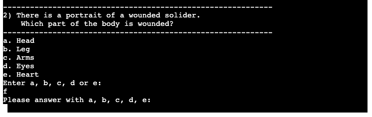
- Once the user enters an answer, the selected answers will be appended to the selected answers list and later used to count by comparing the psychopath's answers.

### 6. Result
- Once the user finishes the final question, three different results according to the number of counts will show up on the console. 
  - If the count of selected answer compared with the psychopath's answer is 0 ~ 1, user will have a message '{username}'s psycho rate is 0! Hooray!'
  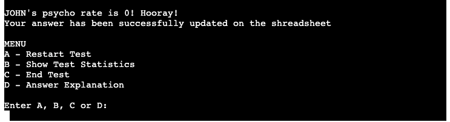

  - If the count is 2 ~ 4, user will have a message '{username}'s psycho rate is a bit high...'
  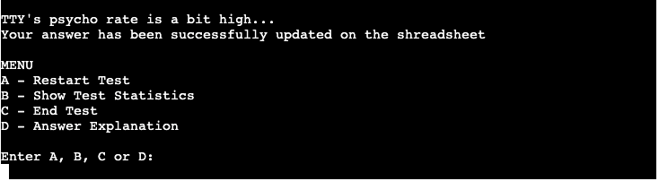

  - If the count is 5 ~ 6, user will have a message '{username}...You are a psychopath.. {country} should be warned!'
  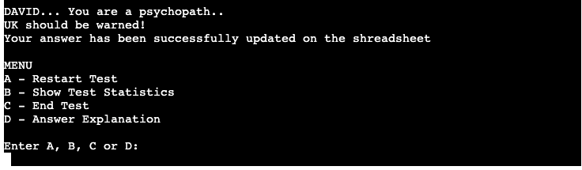
- After each result message, the selected answers will be added to the psychopath-test [spreadsheet](https://docs.google.com/spreadsheets/d/1bo-Los9Mt4UKrzGaHcbPn2Q2GhWrIb03NN53P9FEPwQ/edit#gid=0) on Google Docs that should be used to count every selected answers so that the program could make a statistics of the total result. 
- In the spreadsheet, [user-answers sheet](https://docs.google.com/spreadsheets/d/1bo-Los9Mt4UKrzGaHcbPn2Q2GhWrIb03NN53P9FEPwQ/edit#gid=0) accumulates all the answers from every test by adding a new row, and [answers-stats sheet](https://docs.google.com/spreadsheets/d/1bo-Los9Mt4UKrzGaHcbPn2Q2GhWrIb03NN53P9FEPwQ/edit#gid=812669833) will calculate every selected answers for each question.
- Menu with 4 different selections will also be shown up. 

### 7. Menu
- Menu have 4 options to choose. 
- Input answers will be capitalized.

  - A - Restart Test: Restart the test from entering name.
  

  - B - Show Test Statistics: Show the total number of selected answers for each question.
  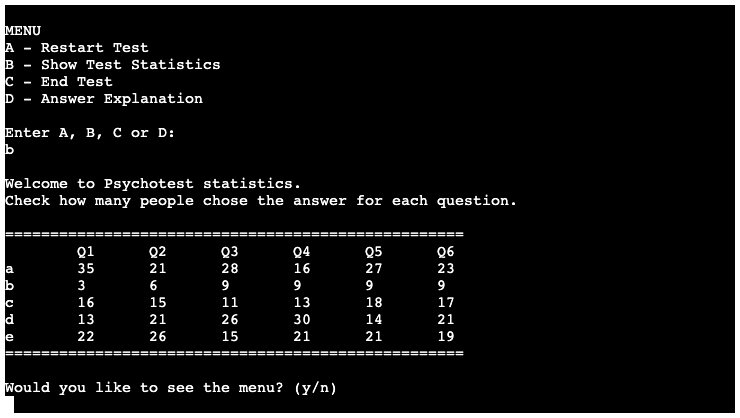

  - C - End Test: Quit the console.
  
  
  - D - Answer Explanation: See which answer is the true answer as a psychopath.
  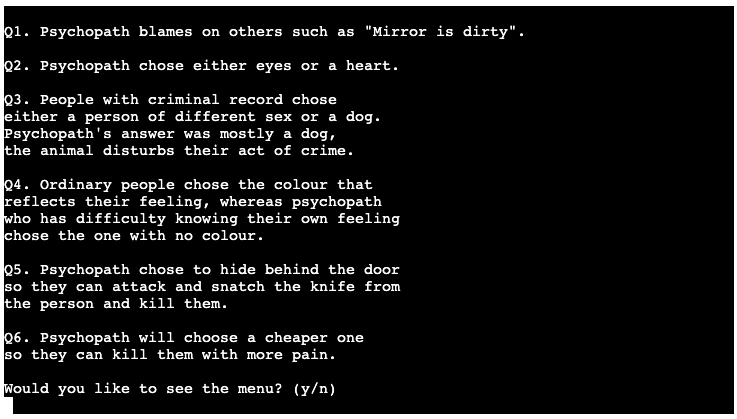

### 8. Would you like to see the menu?
- After selecting A, B or D from the menu, the user will then asked to see the menu or not. 
  - y: Starts the menu function to show the menu.  
  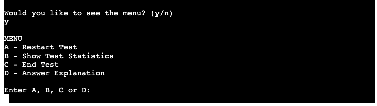

  - n: End the console.
  

  - Input anything other than y or n: 'Invalid answer' message show up and have the 'Would you like to see the menu' input again.
  

## Python Validation Check

- Python validation check has been conducted through [PEP8 Python Validator](https://pep8ci.herokuapp.com/#) provided by Code Institute.
- No errors were found. 

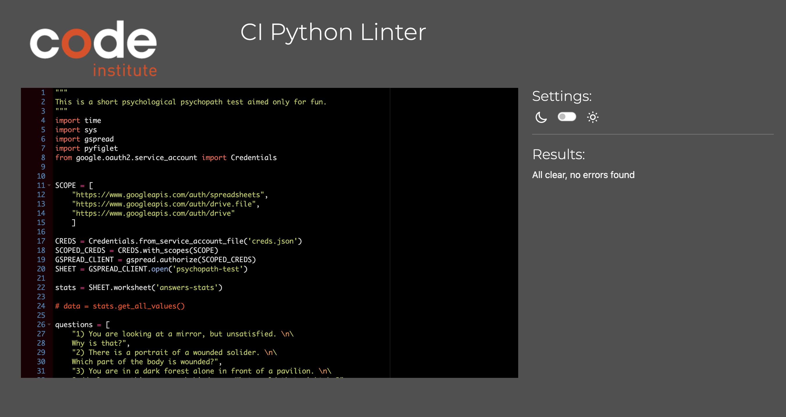

## Lighthouse Check

- Desktop
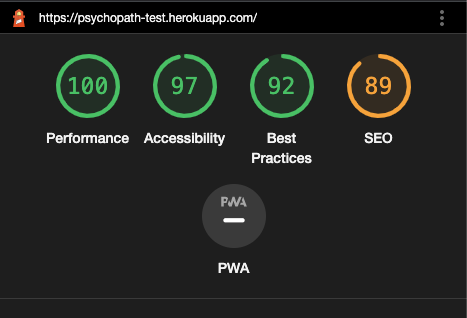

- Mobile
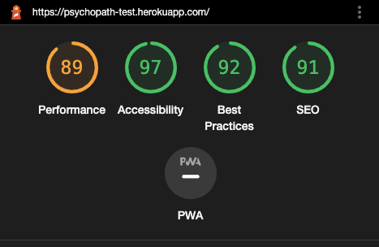

## Testing

| Action | Expected Behavior    | Pass or Fail    |
| :---:   | :---: | :---: |
| Visit to the deployed site | run.py should run | P |
| Press Enter | Disclaimer and name input field should show up | P |
| Press Enter without any input | 'Invalid input' message | P |
| Type anything on name input | 'Hello, {username}' & Enter country input | P |
| Press Enter without any input | 'Invalid input' message | P |
| Type anything on the country input | Greeting message 'Welcome, {username} from {country}!' & Instruction | P | 
| Press Enter | First question, answer options and answer input | P |
| Type anything except a, b, c, d, or e | 'Please answer with a, b, c, d, e' message | P |
| Type a, b, c, d or e | Next question | P |
| On sixth question, type a, b, c, d or e | Show result & 'Answer being updated to spreadsheet' message & Menu option | P | 
| On menu, type anything except a, b, c or d | 'Invalid input' message & Enter A, B, C or D input | P |
| On menu, type a or A | Restart test from entering name | P | 
| On menu, type b or B | Print statistics table | P |
| On menu, type c or C | End console | P |
| On menu, type d or D | Print test explanation for each question | P |
| After menu B or D, from 'Would you like to see the menu' type y or Y | See the menu | P |
| After menu B or D, from 'Would you like to see the menu' type n or N | End console | P |
| After menu B or D, from 'Would you like to see the menu' type else than y or n | 'Invalid input. Would you like to see the menu' | P |

## Deployment

- The site was deployed to Heroku. The steps to deploy are as follows: 
  1. Create a Heroku account.
  2. From the Heroku dashboard, select 'create new app' and create app by adding the app name 'psychopath-test' and choosing the region 'Europe'.
  3. On the tab menu, go to Settings.
  4. Scroll to 'Config Vars'.
  5. From my Gitpod, copy every contents from my creds.json file. 
  6. Move back to Heroku, add a config vars with the key name CREDS and the value of pasting the creds.json contents.
  7. Add one more config vars with the key name PORT and the value 8000.
  8. Scroll to 'Buildpacks'. 
  9. Select 'Add buildpack' and select python and save. 
  10. Select 'Add buildpack' and select nodejs and save. Make sure python is on the top.
  11. Scroll up to see the tab menu and select Deploy.
  12. On Deployment method, select Github.
  13. Connect to Github. 
  14. Search for my repository psychopath-test, and connect.
  15. Select either automatic deploys or manual deploy. 

## Local Deployment

- Local deployment could be done following the steps. 
  1. From my Github repository, click '<>Code' right next to green 'Gitpod' icon. 
  2. Select 'local' and HTTPS.
  3. Copy the HTTPS address: https://github.com/choyoon88/psychopath-test.git
  4. Open terminal on the Mac computer.
  5. Type **_git clone_** and paste the HTTPS address. 
  6. Install the git developer tools and download the command line in your computer. 

## Credits and References
- Test question was taken from Korean psychological test website [vonvon](https://kr.vonvon.me/quiz/60)
- Python main study was conducted by [CodeInstitute](https://learn.codeinstitute.net/dashboard)
- Extra Python study [RealPython](https://realpython.com/)
- Extra Python reading [Python 3.11.3 documentation](https://docs.python.org/3/index.html)
- Flowchart from [Excalidraw](https://excalidraw.com/)
- ASCII artwork instruction from [Dev Dungeon](https://www.devdungeon.com/content/create-ascii-art-text-banners-python)
